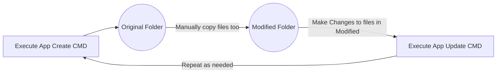

# AWS MGN Launch Template Editor

This tool was written in order to not have to deal with 6 actions just to make one minor change to a launch configuration of a Migration Manager Launch Template. Basic order of operations is that you will speak with client about a change. Locate the Source Server, Click on the Launch Templates tab, Then click on Modify Launch Template which brings you to EC2 Launch Templates and Finally you make your adjustments and save. But if you make a mistake you have to either know which template you were working on to add a new version and set it as default 3 actions. Not to mention you will have to perform the prior steps over and over if were talking about multiple servers.

So what does this application do? It will filter the EC2 Launch Templates for a given account and create a folder system for you to work with the various documents. It will create a folder called `Original` in the working directory, the application will grab the latest default working copy of all MGN templates with the exception of the default template that MGN uses as it's starting point for all new source servers, reason is changing this is not done often enough to warrant using it in this method. I'll be adding an enhancement later if this is a future requirement. The other working folder `Modified` will be empty. The actions required are simple. Copy the templates from the `Original` folder into the `Modified` folder and make your changes. The application doesn't care about the `Original` folder. However if you run the tool it will overwrite the documents with the latest each time. So if you make a mistake or need a fresh copy just execute the commands below to grab a new working copy.

## Commands

Arguments used for this tool

### Help

Used to gather information about a specific argument that is passed.

```Bash
usage: main.py [-h] [--region REGION] {create,update,cleanup} ...

This script will be used to easily manage MGN launch templates. It will allow you to create the original files, update the launch templates, or cleanup the Original and Modified folders and files.

positional arguments:
  {create,update,cleanup}
    create              Create original files
    update              Update launch templates
    cleanup             Cleanup Original and Modified folders and files

options:
  -h, --help            show this help message and exit
  --region REGION       AWS region to search and modify launch templates for the default action
```

### Create

Used to grab the default templates from the AWS EC2 Account. Need to ensure your working in the same region/account where Migration Manager resides.

```bash
usage: main.py create [-h] region

positional arguments:
  region      AWS region to search and modify launch templates

options:
  -h, --help  show this help message and exit
```

### Update

Used to upload the templates in the modified directory as the next iteration in version to their parent templates, will skip any missing templates but notify as output on which template id's are missing. I can't track the source server name at this time.

```bash
usage: main.py update [-h] region

positional arguments:
  region      AWS region to search and modify launch templates

options:
  -h, --help  show this help message and exit
```

### Cleanup

Used to clean up the working folders, the intention for this is to be used with a pipeline experience or for local testing

```bash
usage: main.py cleanup [-h]

options:
  -h, --help  show this help message and exit
```

## Files

As mentioned earlier there are a few intentions that will be worked out for this application to be completed in a code based pipeline methodology. Currently the easy method would be to clone this repository down and follow the workflow outlined below.



Working Directory Structure

```bash
.
├── LICENSE
├── Modified
│   └── EXAMPLE.json
├── Original
│   └── EXAMPLE.json
├── README.md
├── main.py
├── poetry.lock
└── pyproject.toml
```
